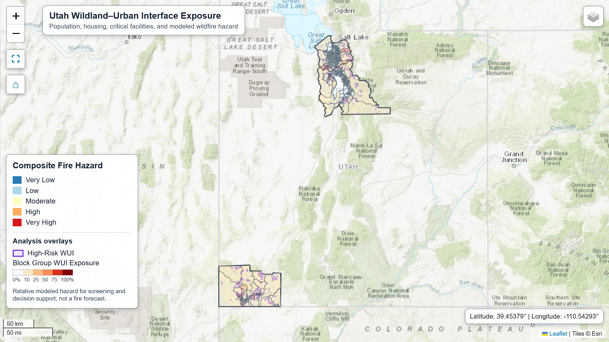
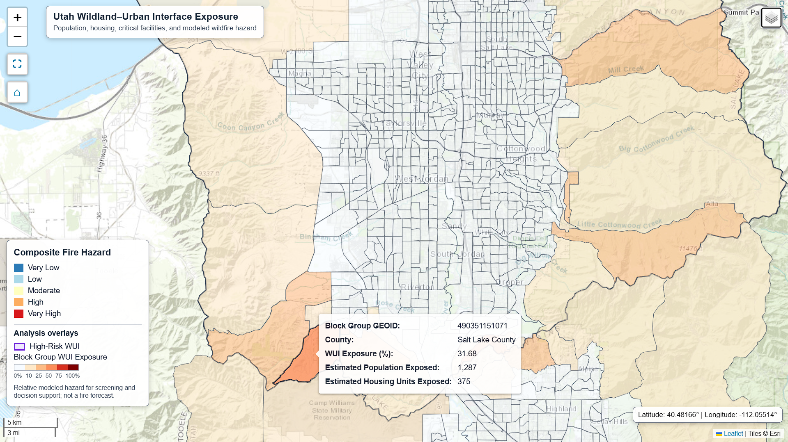
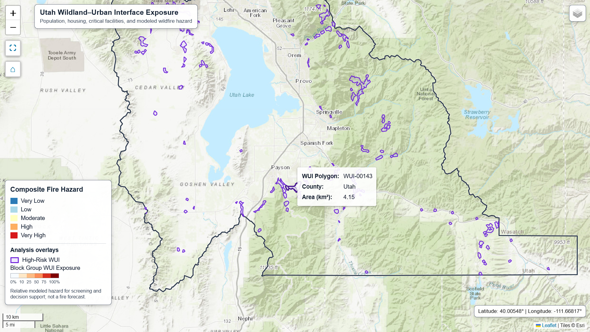
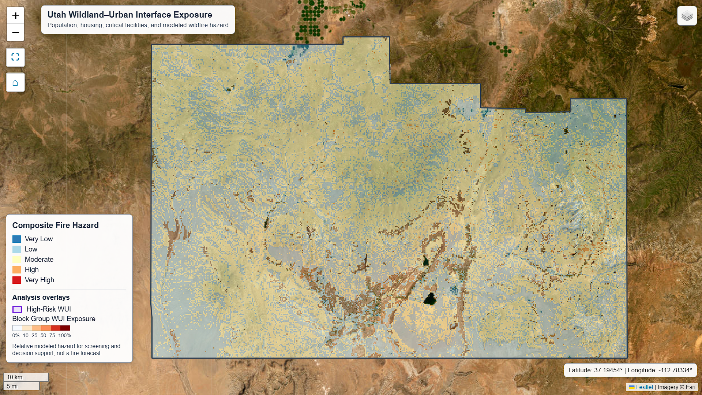

# Utah Wildland–Urban Interface Exposure Analysis

A reproducible geospatial analysis of population, housing, critical-facility, and wildfire-hazard exposure within high-risk wildland–urban interface areas in Utah.

The project evaluates Salt Lake, Utah, and Washington counties using census geography, demographic estimates, WUI boundaries, vegetation and fuel conditions, terrain, historical fire activity, roads, land cover, and critical-facility locations.



*Study-area overview of the integrated wildfire-hazard and WUI-exposure dashboard for Salt Lake, Utah, and Washington counties.*

## Project Objective

The objective is to identify where high-risk WUI areas intersect populated census block groups, evaluate environmental conditions associated with wildfire hazard, and summarize the people, housing units, and critical facilities potentially exposed.

This project demonstrates an end-to-end geospatial data-science workflow, including:

- Programmatic data acquisition and validation
- Raster and vector data processing
- Coordinate-reference-system management
- Spatial overlays, clipping, and proximity analysis
- Census demographic integration
- Composite hazard modeling
- Exposure estimation and aggregation
- Quality-control testing
- Interactive web-map development

## Research Questions

1. Where do designated high-risk WUI areas overlap populated census block groups?
2. How many residents and housing units are located within the affected block groups?
3. How does modeled wildfire hazard vary across the study area?
4. Which critical facilities are located within or near high-risk WUI areas?
5. How can these results be communicated through an interactive decision-support dashboard?

## Study Area

The study covers three Utah counties:

- Salt Lake County
- Utah County
- Washington County

All projected spatial analysis is performed in **NAD83 / UTM Zone 12N (EPSG:26912)** to support consistent area, distance, and proximity calculations.

## County Analysis Views



*Block-group WUI exposure in Salt Lake County, including estimated population and housing exposure within the selected block group.*



*High-risk WUI polygons across Utah County, illustrating where developed areas intersect wildfire-prone landscapes.*



*Composite fire-hazard classifications across Washington County displayed over Esri World Imagery.*

## Key Findings

The published analysis identified:

| Metric | Result |
|---|---:|
| Census block groups analyzed | 1,240 |
| Block groups with high-risk WUI exposure | 111 |
| Estimated residents in exposed block groups | 19,192 |
| Estimated housing units in exposed block groups | 6,933 |
| High-risk WUI overlap | 407.24 km² |
| Critical facilities evaluated | 1,823 |
| Critical facilities located within high-risk WUI | 27 |
| Critical facilities located within one mile of high-risk WUI | 178 |

Population and housing figures represent estimates associated with exposed census block groups. They should not be interpreted as exact structure-level counts within WUI boundaries.

## Analytical Workflow

The notebook implements the following workflow:

1. Define the study area and projected coordinate system.
2. Acquire or load validated census, WUI, infrastructure, environmental, and historical-fire datasets.
3. Standardize coordinate systems, schemas, geometries, and spatial extents.
4. Clip high-risk WUI polygons to the three-county study area.
5. Measure WUI overlap within census block groups.
6. Integrate ACS population and housing estimates.
7. Prepare vegetation, fuels, terrain, fire-history, road, and land-cover indicators.
8. Normalize the model inputs and construct a composite fire-hazard index.
9. Classify the composite index into five relative hazard categories.
10. Evaluate critical facilities located within and near high-risk WUI areas.
11. Validate intermediate and final analytical products.
12. Build an interactive dashboard for exploring the results.

## Composite Fire-Hazard Model

The composite model combines indicators representing:

- Vegetation condition
- Surface and canopy fuels
- Terrain
- Historical fire activity
- Roads and other human ignition indicators
- Developed-land patterns

The resulting categories—Very Low, Low, Moderate, High, and Very High—represent relative modeled hazard within this project. They are not official wildfire forecasts, evacuation products, or replacements for authoritative agency assessments.

## Data Sources

Primary data providers include:

- U.S. Census Bureau
- Utah Geographic Information Systems
- NASA
- Microsoft Planetary Computer
- LANDFIRE
- U.S. Geological Survey
- National Interagency Fire Center
- U.S. Forest Service
- Monitoring Trends in Burn Severity
- Multi-Resolution Land Characteristics Consortium

Detailed dataset descriptions, publication modes, refresh behavior, and licensing information are available in [`data/README.md`](data/README.md).

## Repository Structure

```text
utah-wui-exposure-analysis/
├── README.md
├── environment.yml
├── .gitignore
├── data/
│   └── README.md
├── images/
│   ├── utah_wui_dashboard_overview.png
│   ├── salt_lake_county_wui_exposure.png
│   ├── utah_county_high_risk_wui.png
│   └── washington_county_composite_fire_hazard.png
└── notebooks/
    └── utah_wui_exposure_analysis.ipynb
```

Large raw, cached, intermediate, and processed geospatial datasets are intentionally excluded from the repository.

## Explore the Analysis

The complete analysis is available in:

[`notebooks/utah_wui_exposure_analysis.ipynb`](notebooks/utah_wui_exposure_analysis.ipynb)

GitHub displays the saved notebook outputs, tables, static visualizations, and narrative without requiring the notebook to be executed. The interactive dashboard should be opened through its separately published web link once available.

For the best recruiter review experience, open the notebook directly in GitHub and use the table of contents to navigate between the analytical sections.

## Reproducing the Environment

The analysis was validated with:

- Python 3.14.7
- NumPy 2.4.6
- Rasterio 1.5.1
- GeoPandas 1.1.4
- Shapely 2.1.2

NumPy is constrained to versions below 2.5 for compatibility with the verified geospatial environment.

Create the Conda environment from the repository root:

```bash
mamba env create -f environment.yml
```

Activate the environment:

```bash
mamba activate wui-professional-314
```

Start JupyterLab:

```bash
jupyter lab
```

Then open:

```text
notebooks/utah_wui_exposure_analysis.ipynb
```

## Data Modes

The publication notebook uses:

```python
census_geography_data_mode = "snapshot"
acs_data_mode = "snapshot"
fire_hazard_data_mode = "snapshot"
```

These three modes were used to load the validated census-geography, ACS demographic, and fire-hazard inputs that produced the published results. However, the complete snapshot and cached datasets are not included in this repository because they require multiple gigabytes of storage.

A user starting from a fresh clone will need to configure the workflow to refresh the required data:

```python
census_geography_data_mode = "refresh"
acs_data_mode = "refresh"
fire_hazard_data_mode = "refresh"
```

`census_geography_data_mode` controls whether the notebook loads the validated census-geography snapshot or downloads the required county and block-group boundaries again. `acs_data_mode` controls the corresponding ACS demographic inputs, and `fire_hazard_data_mode` controls the environmental and fire-hazard source data and derived caches.

ACS refresh mode requires a U.S. Census API key. Census-geography and fire-hazard refresh modes require network access, while fire-hazard refresh mode can also require substantial download time, disk space, memory, and processing time.

Refreshing upstream datasets may produce results that differ from the published analysis.

## Validation and Quality Control

The workflow includes checks for:

- Expected coordinate-reference systems
- Invalid or empty geometries
- Duplicate geographic identifiers
- Census-table completeness
- Raster resolution, bounds, and alignment
- Missing and non-finite values
- Spatial-overlay consistency
- Hazard-score ranges and classifications
- Exposure-summary reconciliation
- Required dashboard layers and basemaps

The publication notebook was restarted, cleared, and executed from beginning to end in the verified environment before release.

## Limitations

- The composite hazard index is an analytical model, not an official wildfire-risk product.
- Model results depend on the selected indicators, transformations, weights, classifications, spatial resolutions, and source dates.
- Census block-group summaries do not provide structure-level or household-level exposure estimates.
- Critical-facility results depend on the completeness and positional accuracy of published facility datasets.
- Source datasets represent different collection dates and update schedules.
- MTBS fire-perimeter data were configured as an optional input but were unavailable during the publication run. The historical-fire component therefore used the available InFORM fire-occurrence data.
- Refreshing external data may change the results.
- The analysis does not model active fire behavior, weather, suppression capability, evacuation time, or future climate conditions.

## Potential Extensions

Potential extensions include:

1. Testing alternative model weights and classification methods through sensitivity analysis.
2. Integrating building footprints, address points, or parcel data for higher-resolution exposure estimates.
3. Expanding the workflow to additional Utah counties and establishing a controlled update process.

## Tools and Technologies

- Python
- JupyterLab
- GeoPandas
- Pandas
- NumPy
- Shapely
- Rasterio
- Folium
- Matplotlib
- Conda and Mamba
- REST APIs
- Cloud-hosted geospatial data services

## Intended Use

This project was developed as a professional geospatial data-science portfolio demonstration. It illustrates reproducible spatial analysis, multi-source data integration, environmental hazard modeling, validation, and interactive cartographic communication.

The results are intended for analytical and educational purposes and should not be used for emergency response, evacuation decisions, insurance evaluation, or official hazard designation.

## License

Original code and documentation in this repository are provided under the repository license. External datasets remain subject to the licenses, attribution requirements, and usage policies of their respective publishers.
